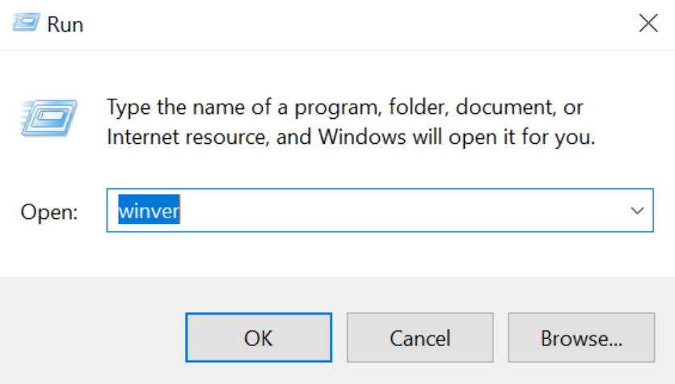

# Apache Superset

Apache Superset is a modern, enterprise-ready business intelligence web application. It is fast, lightweight, intuitive, and loaded with options that make it easy for users of all skill sets to explore and visualize their data, from simple pie charts to highly detailed deck.gl geospatial charts.

## Table of Content
  
  1. [Installation on Windows](#installation-on-windows)
   
     A. [Install Linux on Windows with WSL](#a-install-linux-on-windows-with-wsl)
     
     B. [Download The Linux Kernel Update Package](#b-download-the-linux-kernel-update-package)
     
     C. [Install Docker Desktop](#c-install-docker-desktop)
     
     D. [Launch Superset Through Docker Compose](#d-launch-superset-through-docker-compose)
  
  2. [Creating Dashboards](#creating-dashboards)
   
     A. [Connect to A Database](#a-connect-to-a-database)

     B. [Register A Dataset](#b-register-a-dataset)

     C. [Create A Chart](#c-create-a-chart)

     D. [Create A Dashboard](#d-create-a-dashboard)

## Installation on Windows 

Since Superset is not currently supported on Windows, one option is to install using Docker Desktop on Windows Subsystem for Linux (WSL) 2.

### A. Install Linux on Windows with WSL 

1. Install Windows 10, version 1903 or higher or Windows 11.

2. Join the [Windows Insiders Program](https://insider.windows.com/en-us/getting-started) and choose the Dev channel (You will be asked to restart your computer after the installation). If your installation has been completed:

   - [Windows 10] The display of **Settings - Update & Security - Windows Insider Program** in your computer should be like the following picture:

     

   - [Windows 11] The display of **Settings - Windows Update - Windows Insider Program** in your computer should be like the following picture:

     

3. In the documentation, we are asked to install a preview build of Windows 10 (OS build 20262 or higher) which is supposed to be automatically installed after we join the Windows Insiders Program and choose the Dev channel.

   - In my case, after I joined the program on **Windows 10** and chose the Dev channel, I checked my OS Build and it was still the 19043.1165 version. This is not a problem for me, since I can continue the WSL installation procedure. So if you encountered a similar problem like me you can still continue the process.

   - For **Windows 11**, my OS Build is at the 25151 version.

   - You can check your OS Build version by press the **Windows logo** key + **R**, type **winver** in the **Open** box and then select OK.

       

4. Open a command-line window with Administrator privileges by clicking the **Start** menu - typing **cmd** - right-clicking on the **Command Prompt** tile - clicking **Run as administrator**.

5. I recommend you to use the Ubuntu 20.04 distribution. Therefore, enter this command in the command line you've opened in Admin mode: `wsl --install -d Ubuntu-20.04`.

   - You can check other distributions that are provided by entering this command in the command line : `wsl --list --online`.

6. Restart your computer.

7. Checking whether the installation is completed: click the **Start** menu - open the **Ubuntu 20.04 LTS**.

   - If you can't open the app, try to right-click on the **Ubuntu 20.04 LTS** tile - **More** - **App Settings** - under the **Reset** menu, click **Repair** - reopen the app and the app should work by then. If it does not work, try to restart your computer.

8. Set the default version of WSL to WSL 2 by entering this command in the Command Prompt: `wsl --set-default-version 2`.

   - To check if the process is completed, type in the command: `wsl -l -v`.

     **Notes** : If the above instructions do not work on your computer, try to install the app using the **Manual Installation Steps** you can find [here](https://docs.microsoft.com/en-us/windows/wsl/install-win10).

### B. Download The Linux Kernel Update Package

1. Download the latest package [here](https://wslstorestorage.blob.core.windows.net/wslblob/wsl_update_x64.msi).
2. Run the update package downloaded in the previous step. (Double-click to run - you will be prompted for elevated permissions, select **yes** to approve this installation.).

### C. Install Docker Desktop

1. Download [Docker Desktop for Windows](https://desktop.docker.com/win/main/amd64/Docker%20Desktop%20Installer.exe).

2. Run the Docker Desktop installer:

   - Second option is optional:

     

3. Start Docker Desktop from the **Start** menu.

4. Open **Settings** menu - **General** - select the **Use the WSL 2 based engine** - click **Apply & Restart**.

   - If you have installed Docker Desktop on a system that supports WSL 2, this option will be enabled by default. Thus, skip this step.

        

### D. Launch Superset Through Docker Compose

1.  Clone Superset's repository in the terminal with the following command: `git clone https://github.com/apache/superset.git`.

    - If the process completes successfully, you should see a new folder called `superset` in the current directory.

2.  Navigate to the `superset` folder using the command: `cd superset` and then run the following commands:

    ```
    docker-compose -f docker-compose-non-dev.yml pull
    docker-compose -f docker-compose-non-dev.yml up
    ```

    - If you encountered the following problem:

      `sqlalchemy.exc.ProgrammingError: (psycopg2.errors.UndefinedTable) relation "report_schedule" does not exist`,

      try to run the following code:

      ```
      docker-compose down -v
      docker-compose -f docker-compose-non-dev.yml up
      ```

    - You should see a logging output after running the above commands. If the following output is returned, you already have a a running instance of Superset on your local machine:

        

    - In addition, you should see the following Apps in the Docker Desktop:

        

3.  Access Superset via web browser by visiting `http://localhost:8088`.

    - **Notes**: Do not close the terminal to avoid the Superset's instance to stop.

4.  Log in to Superset using the following credentials:

    ```
    username: admin
    password: admin
    ```

    

5.  To disconnect from Superset, just enter **CTRL** + **C** 2 times in the command line.

    - Other option is to click stop button in the Docker Desktop (the button will appear when you hover on it):

        

6.  To reconnect to Superset, you just need to click the start button in the Docker Desktop (the button will appear when you hover on it) and reopen `http://localhost:8088`.

    

## Creating Dashboards

### A. Connect to A Database

Superset does not have a storage layer to store data, therefore we need to connect to existing SQL database or data store. During the installation via Docker Compose, a Postgres database called **examples** has been pre-configured in Superset. However, here are the steps to connect to a new database:

1. Go to **Data** - **Databases** Menu.
   
   
  
2. Click the **+ Database** button in the top right corner.
3. Choose a database you want to connect and complete the configuration.
   
   - This example shows how to connect to a PostgreSQL database:

     
     
     
     After filling out all the information needed, just click the **Connect** button.

     This last step is optional. You can configure additional options for SQL Lab permission, etc.:

      

      Click the **Finish** button if you have configured the optional configurations.

4. If the process completes successfully, your new database will appear in the **Databases** menu just like the **examples** database. You can also edit the database configuration by clicking the **edit** button in the right side of the database name (the button will appear when you hover on it).

    

### B. Register A Dataset

After configuring the databases, we still need to register datasets to be able to create the visualization. Here are the steps to register a dataset:

1. Go to **Data** - **Datasets** Menu.

   
  
2. Click the **+ Dataset** button in the top right corner.
3. Choose a dataset you want to connect by filling out the configuration.

    - This is an example when you want to register `bi_instagram_profiles` dataset from the `PostgreSQL` database:

      

      After filling out all the information needed, click the **Add** button.

4. If the process completes successfully, your new dataset will appear in the **Datasets** menu. You can also edit the dataset configuration by clicking the **edit** button in the right side of the dataset name (the button will appear when you hover on it).

    

### C. Create A Chart

Superset has a different UX if we compare it with other BI tools. In other BI tools, we can create a chart while creating a dashboard. In Superset, however, we have to create the charts first and then put them in the dashboard. The steps to create a chart:

1. Go to **Charts** menu and click the **+ Chart** button in the top right corner.

    

2. Choose dataset that you want to create a chart from, choose the chart type, and click the **Create New Chart** button.

    

3. Configure the chart you want to create, add the chart name, & click the **Create Chart** button to get the chart preview. 

    - This is an example when you want to create a chart of the `follower_count`'s sum.

      

4. If you edit anything in the chart configuration, do not forget to click the `Update Chart** button. 
   
   

5. After all the configuration suits your needs, click the **Save** button in the top right corner. If you want to directly add the chart to a dashboard, choose it in the **Add to Dashboard** menu. To add the chart to a new dashbaord, type in the name in the same menu. Just leave it blank, if you do not want to add the chart to any dashboard. Then, click **Save**.

6. If the process completes successfully, your new chart will appear in the **Charts** menu. You can also edit the chart configuration by clicking the **edit** button in the right side of the chart name (the button will appear when you hover on it).
    
    

### D. Create A Dashboard

1. Go to **Dashboards** menu and click the **+ Dashboard** button in the top right corner.

    

2. Rename the dashboard and add Layout Elements or Charts to the dashboard.

    

3. After finish the dashboard, do not forget to click the **Save** button in the top right corner. 

4. If the process completes successfully, your new dashboard will appear in the **Dashboards** menu. You can also edit the dashboard configuration by clicking the **edit** button in the right side of the dashboard name (the button will appear when you hover on it).
    
    

